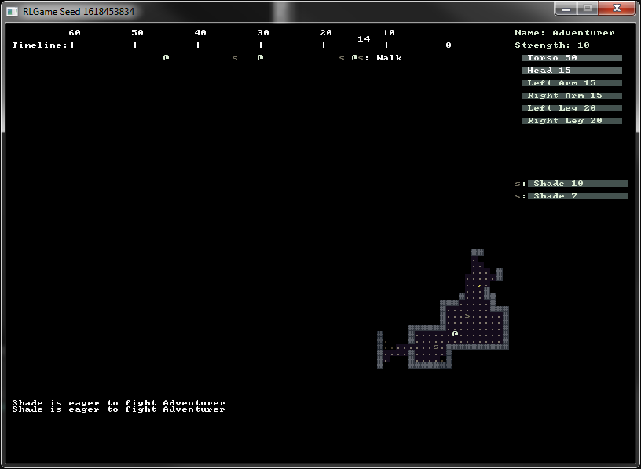

# Roguelike project

This was a C# practice project. It is inspired by traditional roguelikes with ASCII graphics.\
Currently it has basic movement, combat and map generation. Map generation is done\
in the background with multi threading.
